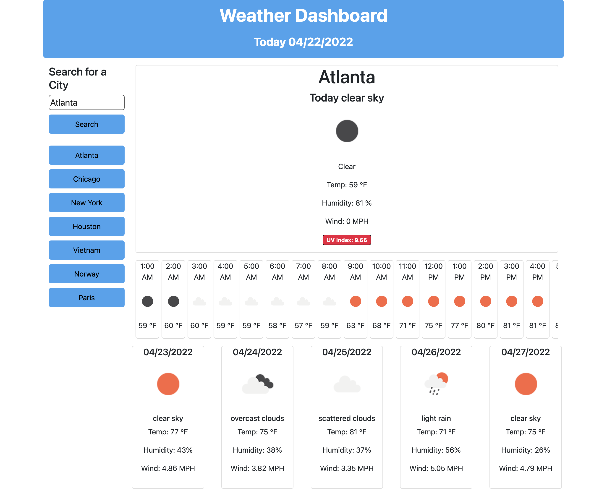

# HW6-Weather-Dashboard# 06 Server-Side APIs: Weather Dashboard
# Dependencies
 - HTML
 - CSS
 - Javascripts
## Project

This project lean how to manipulate the DOM elements using Jquery, bootstrap and javascript. Third-party APIs allow developers to access their data and functionality by making requests with specific parameters to a URL. Developers are often tasked with retrieving data from another application's API and using it in the context of their own. Your challenge is to build a weather dashboard that will run in the browser and feature dynamically updated HTML and CSS.

Use the [OpenWeather One Call API](https://openweathermap.org/api/one-call-api) to retrieve weather data for cities. Read through the documentation for setup and usage instructions. You will use `localStorage` to store any persistent data. For more information on how to work with the OpenWeather API, refer to the [Full-Stack Blog on how to use API keys](https://coding-boot-camp.github.io/full-stack/apis/how-to-use-api-keys).
## Acceptance Criteria

```
GIVEN a weather dashboard with form inputs
WHEN I search for a city
THEN I am presented with current and future conditions for that city and that city is added to the search history
WHEN I view current weather conditions for that city
THEN I am presented with the city name, the date, an icon representation of weather conditions, the temperature, the humidity, the wind speed, and the UV index
WHEN I view the UV index
THEN I am presented with a color that indicates whether the conditions are favorable, moderate, or severe
WHEN I view future weather conditions for that city
THEN I am presented with next 24 hours forecast plus next 5-day forecast that displays the date, an icon representation of weather conditions, the temperature, the wind speed, and the humidity
WHEN I click on a city in the search history
THEN I am again presented with current and future conditions for that city
```
# Usage
 You can run a local copy of this site by issuing the following commands. 
```bash
$ git clone https://github.com/vi3t4lov3/HW6-Weather-Dashboard.git
$ cd HW6-Weather-Dashboard
```
## Contributing
1. Fork it
2. Create your feature branch (`git checkout -b my-new-feature`)
3. Commit your changes (`git commit -am 'Add some feature'`)
4. Push to the branch (`git push origin my-new-feature`)
5. Create new Pull Request
## The Demo Page
https://vi3t4lov3.github.io/HW6-Weather-Dashboard/



